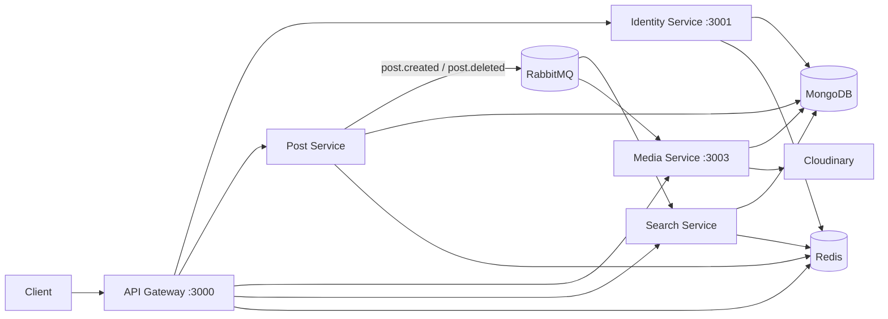

# Social Media Microservice

A distributed social media backend built with Node.js and Express. The system is split into independent microservices that communicate over HTTP (via an API gateway) and asynchronous events (via RabbitMQ). It supports user authentication, post management, media uploads, and full-text search.

## Architecture



| Service | Default Port | Responsibility |
|---------|--------------|----------------|
| **API Gateway** | 3000 | Single entry point, JWT validation, rate limiting, request proxying |
| **Identity Service** | 3001 | User registration, login, JWT access/refresh tokens, logout |
| **Post Service** | — | Create, read, list, and delete posts; publishes domain events |
| **Media Service** | 3003 | Upload and list media files via Cloudinary |
| **Search Service** | — | Full-text search over posts (synced via events) |

## Tech Stack

- **Runtime:** Node.js (ES modules)
- **Framework:** Express 5
- **Database:** MongoDB (Mongoose)
- **Cache & rate limiting:** Redis (ioredis)
- **Message broker:** RabbitMQ (amqplib, topic exchange `social_media_events`)
- **Auth:** JWT, Argon2 password hashing
- **Media storage:** Cloudinary
- **Validation:** Joi
- **Logging:** Winston

## Prerequisites

- Node.js 18+
- MongoDB
- Redis
- RabbitMQ
- Cloudinary account (for media uploads)

## Project Structure

```
social-media-microservice/
├── api-gateway/          # Reverse proxy, auth, rate limiting
├── identity-service/     # Users, login, tokens
├── post-service/         # Posts CRUD, event publishing
├── media-service/        # File uploads, event consumption
└── search-service/       # Search index, event consumption
```

Each service is a standalone Node.js app with its own `package.json`, `src/` folder, and `.env` file.

## Getting Started

### 1. Install dependencies

From the repository root, install dependencies in each service:

```bash
cd api-gateway && npm install
cd ../identity-service && npm install
cd ../post-service && npm install
cd ../media-service && npm install
cd ../search-service && npm install
```

### 2. Configure environment variables

Create a `.env` file in each service directory. Example values:

**api-gateway/.env**

```env
PORT=3000
REDIS_URL=redis://localhost:6379
JWT_SECRET=your-jwt-secret
IDENTITY_SERVICE_URL=http://localhost:3001
POST_SERVICE_URL=http://localhost:3002
MEDIA_SERVICE_URL=http://localhost:3003
SEARCH_SERVICE_URL=http://localhost:3004
```

**identity-service/.env**

```env
PORT=3001
MONGO_URI=mongodb://localhost:27017/social-media-identity
REDIS_URL=redis://localhost:6379
JWT_SECRET=your-jwt-secret
```

**post-service/.env**

```env
PORT=3002
MONGO_URI=mongodb://localhost:27017/social-media-posts
REDIS_URL=redis://localhost:6379
JWT_SECRET=your-jwt-secret
RABBITMQ_URL=amqp://localhost
```

**media-service/.env**

```env
PORT=3003
MONGO_URI=mongodb://localhost:27017/social-media-media
JWT_SECRET=your-jwt-secret
RABBITMQ_URL=amqp://localhost
```

**search-service/.env**

```env
PORT=3004
MONGO_URI=mongodb://localhost:27017/social-media-search
REDIS_URL=redis://localhost:6379
JWT_SECRET=your-jwt-secret
RABBITMQ_URL=amqp://localhost
```

> Use the same `JWT_SECRET` across all services that validate tokens.

### 3. Start services

Start infrastructure (MongoDB, Redis, RabbitMQ), then run each service. In separate terminals:

```bash
cd identity-service && npm run dev
cd post-service && npm run dev
cd media-service && npm run dev
cd search-service && npm run dev
cd api-gateway && npm run dev
```

Production:

```bash
npm start
```

## API Reference

All client requests go through the API gateway at `http://localhost:3000/v1`. Protected routes require an `Authorization: Bearer <accessToken>` header.

### Authentication (`/v1/auth`)

| Method | Endpoint | Auth | Description |
|--------|----------|------|-------------|
| POST | `/v1/auth/register` | No | Register a new user |
| POST | `/v1/auth/login` | No | Log in and receive tokens |
| POST | `/v1/auth/refreshToken` | No | Refresh access token |
| POST | `/v1/auth/logout` | No | Invalidate refresh token |

**Register / login body:**

```json
{
  "username": "johndoe",
  "email": "john@example.com",
  "password": "securePassword123"
}
```

### Posts (`/v1/posts`)

| Method | Endpoint | Auth | Description |
|--------|----------|------|-------------|
| POST | `/v1/posts/create-post` | Yes | Create a post |
| GET | `/v1/posts/all-posts?page=1&limit=10` | Yes | List current user's posts (paginated, cached) |
| GET | `/v1/posts/get-post/:id` | Yes | Get a single post by ID |
| DELETE | `/v1/posts/:id/` | Yes | Delete a post |

**Create post body:**

```json
{
  "content": "Hello, world!",
  "mediaIds": []
}
```

### Media (`/v1/media`)

| Method | Endpoint | Auth | Description |
|--------|----------|------|-------------|
| POST | `/v1/media/upload` | Yes | Upload a file (`multipart/form-data`, field: `file`) |
| GET | `/v1/media/all-medias` | Yes | List uploaded media for the user |

### Search (`/v1/search`)

| Method | Endpoint | Auth | Description |
|--------|----------|------|-------------|
| GET | `/v1/search/posts?query=hello` | Yes | Full-text search over post content |

## Event-Driven Communication

Services use a RabbitMQ topic exchange named `social_media_events`:

| Event | Publisher | Consumers | Purpose |
|-------|-----------|-----------|---------|
| `post.created` | Post Service | Search Service | Index new posts for search |
| `post.deleted` | Post Service | Search Service, Media Service | Remove search index entries and associated media |

## Features

- **API Gateway** — Centralized routing, Helmet security headers, CORS, IP-based rate limiting (Redis-backed)
- **Identity** — Argon2 password hashing, access + refresh token flow, refresh token persistence
- **Posts** — Redis caching for list/detail views, cache invalidation on writes
- **Media** — Multer file handling, Cloudinary upload, cleanup on post deletion
- **Search** — MongoDB text indexes, eventually consistent index via RabbitMQ events

## Development

Each service supports hot reload during development:

```bash
npm run dev   # uses nodemon
```

Logs are written via Winston to the console (and `combined.log` in some services).

## License

ISC
